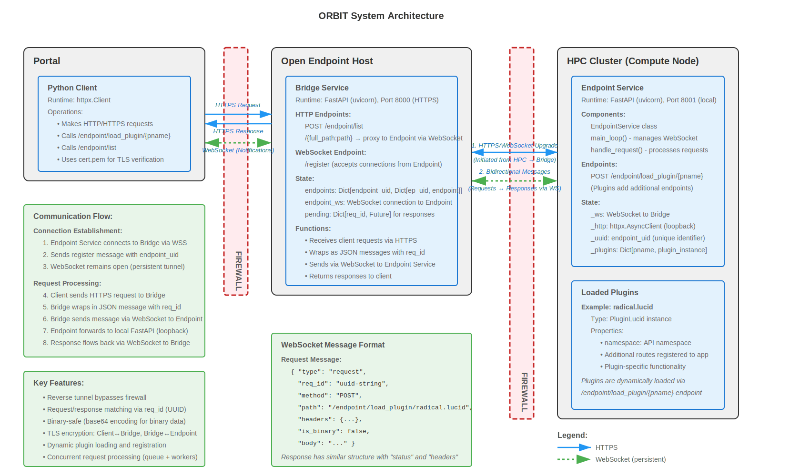

# ORBIT - 6 Month Development Roadmap

**Timeline:** February 2026 - July 2026
**Resources:** 1 developer @ ~96 hours/month

---

## Timeline Summary

| Month   | Focus Area            | Deliverables                                       |
|---------|-----------------------|----------------------------------------------------|
| 1 (Feb) | Foundation            | Documentation, testing, stabilization, CI/CD, performance char. |
| 2 (Mar) | Scaling               | Multi-endpoint, multi-client, monitoring               |
| 3 (Apr) | Framework             | Plugin base class, developer tools, Lucid refactor |
| 4 (May) | Core Plugins          | Lucid refinement, Rhapsody implementation          |
| 5 (Jun) | Additional Plugins    | XGFabric, ATOMIC, ROSE plugins                     |
| 6 (Jul) | Advanced & Production | MCP integration, AMSC evaluation, hardening        |

---

## System Architecture

---

## Month 1: Foundation & Documentation (February 2026)

### Document Current State (24h)
- Architecture doc (system design, data flow, security model, deployment topology)
- API docs (Bridge endpoints, Endpoint endpoints, WebSocket protocol, plugin interface)
- Code docs (inline docstrings, README, configuration reference)

### Stabilize & Test Current State (48h)
- **Unit tests:** message serialization, req_id matching, base64 encoding, error handling
- **Integration tests:** end-to-end flow, WebSocket reconnection, plugin loading, concurrent requests
- **Error handling:** graceful disconnection/reconnection, timeouts, better logging/errors

### Development Infrastructure (24h)
- **CI/CD:** automated testing, linting (ruff, mypy), Docker builds
- **Dev environment:** mock endpoint service, integration test environment for lucid, xgfabric

---

## Month 2: Multi-Endpoint & Multi-Client Support (March 2026)

### Multi-Endpoint Service Support (56h)
- **Registry:** persistent endpoint registry (endpoint_uid → metadata), health monitoring (heartbeat), capability advertising, dynamic routing
- **Load balancing:** route by capability, round-robin/failover
- **Testing:** multiple endpoints concurrent, failover scenarios, load distribution

### Multi-Client Support (28h)
- **Auth:** API key/token auth, client identity
- **Isolation:** client-to-endpoint authorization, request routing by permissions, audit logging
- **Sessions:** client WebSockets (notifications), session state

### Monitoring & Observability (12h)
- **Metrics:** request count/latency/errors, active WebSockets, endpoint health
- **Logging:** structured logs, request tracing (correlation IDs)
- **Monitoring:** expose metrics to client / portal

---

## Month 3: Plugin Framework & Base Class (April 2026)

### Plugin Base Class Design (20h)
- **Interface:** required methods (`register_routes()`, `get_namespace()`, `initialize()`, `cleanup()`), optional methods (`on_endpoint_connect()`, `health_check()`), lifecycle mgmt, config schema
- **Discovery/loading:** plugin registry, dynamic loading, dependency mgmt, version checks
- **Isolation:** route namespaces, resource quotas, error isolation

### Plugin Base Class Implementation (40h)
- **Core class:** `EndpointPlugin(ABC)` with abstract/concrete methods
- **Manager:** load/unload plugins, state mgmt, config handling
- **Utilities:** auth/authz decorators, serialization helpers, logging utils

### Reference Plugin & Testing (28h)
- **Example:** "Hello World" plugin demonstrating all features, well-documented
- **Testing:** test harness, mock endpoint service, radical.lucid migration to base class
- **Docs:** plugin dev guide, API reference, best practices

### Security Review (8h)
- input validation requirements, auth patterns

---

## Month 4: Core Plugins - Lucid & Rhapsody (May 2026)

### Radical Lucid Plugin (28h)
- **Refinement:** API spec review, use plugin base class, error handling, input validation, performance optimization
- **Testing:** unit tests (all endpoints), integration tests (Lucid backend), load testing
- **Docs:** API docs, usage examples, deployment guide

### Radical Rhapsody Plugin (40h)
- **Requirements:** Rhapsody exposure needs, auth requirements, data flow patterns
- **API spec:** endpoints, schemas (OpenAPI), WebSocket needs
- **Implementation:** plugin base class, backend integration, error handling, validation
- **Testing:** unit tests, integration tests (Rhapsody backend), e2e workflows
- **Docs:** API docs, usage guide, integration examples

### Integration & Stack Testing (28h)
- **Stack:** Docker Compose orchestration, K8s manifests (if applicable), env config, secrets mgmt
- **E2E testing:** multi-plugin scenarios, plugin interactions, load testing
- **Docs:** production deployment guide, monitoring/troubleshooting, backup/recovery

---

## Month 5: Additional Plugins - XGFabric, ATOMIC, ROSE (June 2026)

### XGFabric Plugin (28h)
- API spec (endpoints, models, auth) (8h), implementation (backend integration, error handling) (14h), testing & docs (6h)

### ATOMIC Plugin (28h)
- API spec (8h), implementation (14h), testing & docs (6h)

### ROSE Plugin (28h)
- API spec (8h), implementation (14h), testing & docs (6h)

---

## Month 6: Advanced Features & Production Readiness (July 2026)

### MCP Endpoint Integration (38h)
- **Analysis:** MCP spec review, integration points, adapter layer design (8h)
- **Implementation:** expose Endpoint as MCP tools, map plugins to MCP resources, tool/resource discovery (16h)
- **Client integration:** Claude/MCP client support, auth/authz, rate limiting (8h)
- **Testing & docs:** protocol compliance, Claude integration, multi-client scenarios, integration guide (6h)

### AMSC Integration Evaluation (20h)
- **Analysis:** requirements (data flow, auth, performance), integration design (plugin vs core), API/security model (12h)
- **PoC:** minimal implementation, performance/security testing, go/no-go decision (8h)

### Production Hardening (28h)
- **Security:** audit all components, penetration testing (if available), CVE scanning, secrets mgmt review, TLS hardening (10h)
- **Performance:** profiling/optimization, connection pooling tuning, memory optimization, load testing/capacity planning (8h)
- **Reliability:** graceful degradation, circuit breakers, retry logic, health checks (6h)
- **Operations:** deployment automation, monitoring/alerting, log aggregation, incident response, backup/DR (4h)

### Final Documentation (10h)
- **Ops manual:** deployment, config reference, monitoring/alerting, troubleshooting, common issues
- **Dev docs:** contribution guide, architecture, testing, release process
- **User docs:** getting started, API reference (all plugins), best practices, FAQ

---

